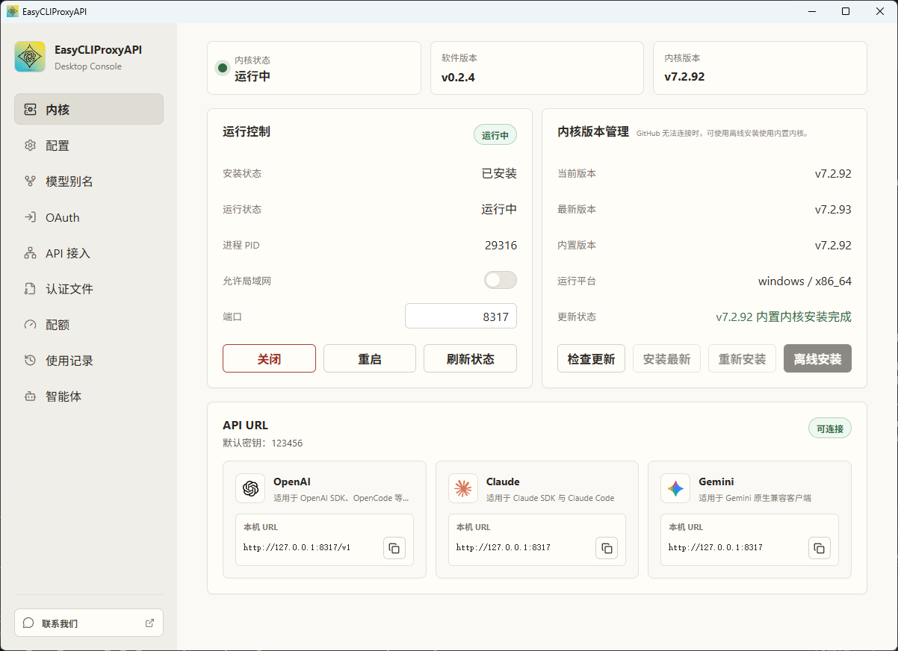
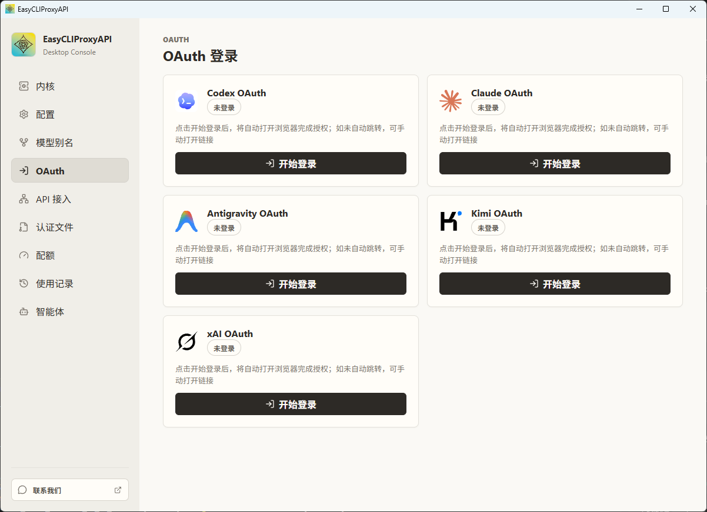
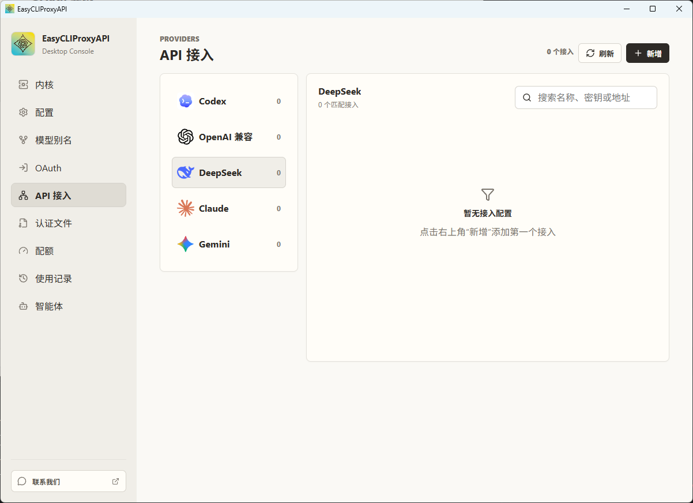
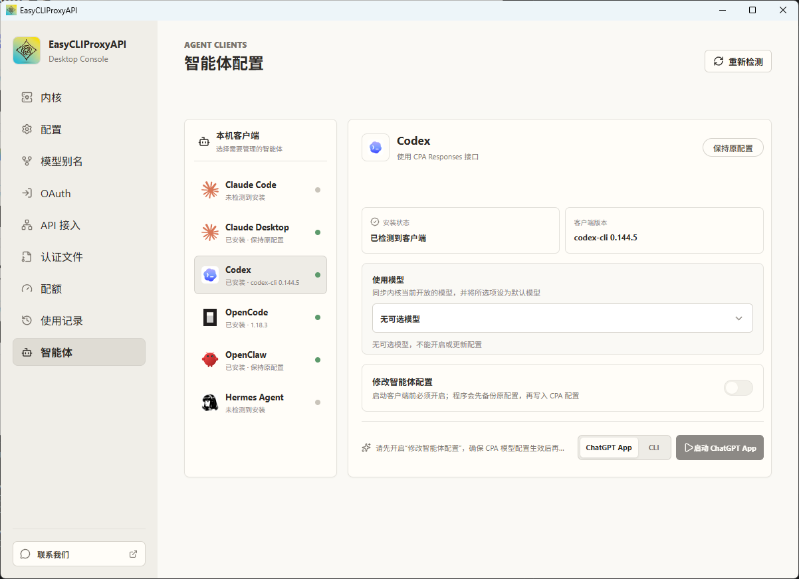

  <a href="README.md">English</a> |
  <strong>简体中文</strong> |
  <a href="README.ja.md">日本語</a>

  

<h1 align="center">EasyCLIProxyAPI</h1>

  CLIProxyAPI 的便携桌面控制台。 
  我们的目标是实现 token free（free 在这里的意思是自由）。

## 项目简介

EasyCLIProxyAPI 是基于 [CLIProxyAPI](https://github.com/router-for-me/CLIProxyAPI)
构建的图形化桌面管理工具。它将内核生命周期管理、OAuth 授权、API Provider 聚合、协议转换、
凭证管理、配额查询、使用记录、模型别名和智能体客户端配置集中到一个界面中。

软件基于 Tauri、React 和 Rust 构建，并可携带匹配版本的 CLIProxyAPI 内核压缩包，
让首次安装和离线安装更加方便。

## 功能导览

### 内核控制台与版本管理

内核页面集中展示本地代理服务的运行情况，并提供完整的控制能力：

- 启动、关闭、重启和刷新 CLIProxyAPI 内核状态。
- 查看安装状态、运行状态、进程 PID、监听端口和局域网访问设置。
- 对比当前版本、最新版本和软件内置的内核版本。
- 安装最新版、重新安装，或在无法连接 GitHub 时使用离线安装包。
- 复制可直接使用的 OpenAI、Claude 和 Gemini 兼容 API 地址。
- 在同一页面查看 EasyCLIProxyAPI 软件版本和本地连接状态。

### OAuth 账号授权

OAuth 页面集中管理支持的浏览器授权登录：

- Codex OAuth
- Claude OAuth
- Antigravity OAuth
- Kimi OAuth
- xAI OAuth

EasyCLIProxyAPI 会自动打开浏览器授权页面；当浏览器无法自动跳转回来时，也支持手动完成回调流程。

### API Provider 聚合管理

API 接入页面按照协议或 Provider 管理上游 API 凭证和服务地址：

- Codex
- OpenAI 兼容 Provider
- DeepSeek
- Claude
- Gemini

你可以添加多个接入配置、搜索已有配置、刷新 Provider 状态，并通过统一的本地 CLIProxyAPI
地址调用它们。请求和响应可以在 OpenAI、Claude、Gemini 及其他兼容协议之间转换。

### 智能体客户端配置

智能体页面会检测本机已安装的桌面端和命令行客户端，并帮助它们连接本地代理。支持的客户端包括：

- Claude Code
- Claude Desktop
- Codex
- OpenCode
- OpenClaw
- Hermes Agent

对于受支持的客户端，软件可以同步可用模型目录、选择默认模型、在应用托管配置前备份原始配置、
恢复之前的配置，以及启动可用的桌面端或命令行入口。

## 其他功能

- 管理内核配置、API Key、远程管理凭证、插件和路由策略。
- 创建客户端可见的模型别名，并映射到 Provider 模型和推理等级。
- 上传、下载、检查和管理认证文件。
- 查看 Provider 配额和账号可用状态。
- 浏览本地使用记录和 Token 统计数据。
- 通过 macOS 菜单栏或 Windows 系统托盘保持软件在后台运行。

## 快速开始

1. 前往 [GitHub Releases](https://github.com/router-for-me/EasyCLIProxyAPI/releases/latest)
   下载对应操作系统的发行包。
2. 解压 Windows 或 Linux 压缩包，macOS 用户打开 DMG。
3. 启动 EasyCLIProxyAPI。
4. 打开 **内核** 页面，安装内置版本或最新版本的 CLIProxyAPI 内核。
5. 启动内核，然后复制所需的本地 API 地址，或配置 OAuth/API Provider。

## 支持的平台

GitHub Actions 会构建以下发行包：

| 操作系统 | 架构 | 格式 |
| --- | --- | --- |
| Windows | amd64、aarch64 | ZIP |
| macOS | amd64、aarch64 | DMG |
| Linux | amd64、aarch64 | TAR.GZ |

## 相关项目

- [CLIProxyAPI](https://github.com/router-for-me/CLIProxyAPI) — 本软件负责管理的代理内核。
